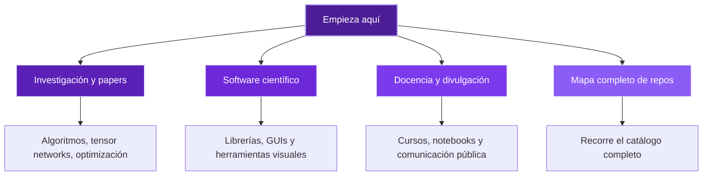

  <a href="./README.md">English</a> |
  <a href="./README.es.md"><strong>Español</strong></a>

  

<h1 align="center">Alejandro Mata Ali</h1>

  <strong>Investigador · Desarrollador de software científico · Docente · Divulgador científico</strong>

  Algoritmos cuánticos, tensor networks, optimización y física computacional convertidos en
  herramientas reutilizables, flujos reproducibles y explicaciones que de verdad se pueden aprovechar.

  Quantum Coordinator en ITCL · Burgos, España

  
  
  

  
  
  
  
  
  

  <a href="#vision-general">Visión General</a> |
  <a href="#proyectos-principales">Proyectos Principales</a> |
  <a href="#brujula-del-perfil">Brújula del Perfil</a> |
  <a href="#investigacion-y-papers">Investigación y Papers</a> |
  <a href="#docencia-y-divulgacion">Docencia y Divulgación</a> |
  <a href="#mapa-de-proyectos">Mapa de Proyectos</a> |
  <a href="#stack">Stack</a>

## Visión General

Este perfil es la página pública de entrada a mi trabajo entre investigación, software científico, docencia y divulgación.
Si llegas aquí desde un paper, un repositorio, un curso o una charla, este README está pensado para ayudarte a encontrar rápido el punto de entrada adecuado.

<table>
  <tr>
    <td width="33%" valign="top">
      <strong>Investigación</strong> 
      Algoritmos cuánticos, tensor networks, métodos de optimización y física computacional conectados con papers, experimentos y flujos reproducibles.
    </td>
    <td width="33%" valign="top">
      <strong>Software Científico</strong> 
      Librerías Python, herramientas visuales, GUIs y plantillas reutilizables que hacen más sencillo inspeccionar, probar y reutilizar flujos avanzados.
    </td>
    <td width="33%" valign="top">
      <strong>Docencia y Divulgación</strong> 
      Cursos, notebooks, demos y comunicación pública pensados para hacer temas avanzados más claros sin vaciarlos de contenido.
    </td>
  </tr>
</table>

<table>
  <tr>
    <td width="50%" valign="top">
      <strong>Si vienes por papers</strong> 
      Empieza en <a href="#investigacion-y-papers">Investigación y Papers</a> y luego abre el <a href="#mapa-de-proyectos">Mapa de Proyectos</a>.
    </td>
    <td width="50%" valign="top">
      <strong>Si vienes por herramientas utilizables</strong> 
      Empieza en <a href="#proyectos-principales">Proyectos Principales</a> para ver los repos más fuertes en software.
    </td>
  </tr>
  <tr>
    <td width="50%" valign="top">
      <strong>Si vienes a aprender</strong> 
      Ve a <a href="#docencia-y-divulgacion">Docencia y Divulgación</a> para cursos, notebooks y demos.
    </td>
    <td width="50%" valign="top">
      <strong>Si quieres verlo todo</strong> 
      Abre el catálogo completo desplegable en <a href="#mapa-de-proyectos">Mapa de Proyectos</a>.
    </td>
  </tr>
</table>

## Proyectos Principales

Estos son los repositorios que mejor representan la intersección entre investigación, herramientas y usabilidad dentro de mi trabajo.

<table>
  <tr>
    <td width="50%" valign="top">
      <h3><a href="https://github.com/DOKOS-TAYOS/Tensor-Network-Visualization">Tensor-Network-Visualization</a></h3>
      
Visualización 2D y 3D de tensor networks para Torch, NumPy, Quimb, Tensorkrowch, TenPy y TensorNetwork, pensada para análisis, depuración y comunicación.

      
<code>Visualización</code> <code>Python Científico</code> <code>Tensor Networks</code>

    </td>
    <td width="50%" valign="top">
      <h3><a href="https://github.com/DOKOS-TAYOS/Tensor-Network-Editor">Tensor-Network-Editor</a></h3>
      
Editor local interactivo para diseñar tensor networks de forma visual y exportar código Python legible para varios backends.

      
<code>Tensor Networks</code> <code>Herramientas Visuales</code> <code>Generación de Código</code>

    </td>
  </tr>
  <tr>
    <td width="50%" valign="top">
      <h3><a href="https://github.com/DOKOS-TAYOS/quantum-circuit-drawer">quantum-circuit-drawer</a></h3>
      
Librería basada en Matplotlib para dibujar circuitos cuánticos, representar resultados de medida y comparar salidas entre distintos ecosistemas.

      
<code>Circuitos Cuánticos</code> <code>Python</code> <code>Visualización</code>

    </td>
    <td width="50%" valign="top">
      <h3><a href="https://github.com/DOKOS-TAYOS/RegressionLab">RegressionLab</a></h3>
      
Software de ajuste de curvas con interfaz gráfica, múltiples modelos, análisis de incertidumbre y salidas visuales cuidadas para trabajo científico y docente.

      
<code>Análisis de Datos</code> <code>Ajuste de Curvas</code> <code>Software Científico</code>

    </td>
  </tr>
  <tr>
    <td width="50%" valign="top">
      <h3><a href="https://github.com/DOKOS-TAYOS/DifferentialLab">DifferentialLab</a></h3>
      
Solver numérico y visualizador de EDOs, ecuaciones en diferencias y EDPs mediante una interfaz de escritorio accesible en Python.

      
<code>EDOs</code> <code>Simulación</code> <code>Software Científico</code>

    </td>
    <td width="50%" valign="top">
      <h3><a href="https://github.com/DOKOS-TAYOS/Traveling_Salesman_Problem_with_Tensor_Networks">TSP with Tensor Networks</a></h3>
      
Solver del TSP inspirado en ideas cuánticas, construido como una exploración de investigación sobre tensor networks, optimización y comunicación científica.

      
<code>Investigación</code> <code>Optimización</code> <code>Tensor Networks</code>

    </td>
  </tr>
</table>

## Brújula del Perfil

## Investigación y Papers

Estos repositorios están conectados directamente con papers, experimentos e ideas algorítmicas:

- [TSP with Tensor Networks](https://github.com/DOKOS-TAYOS/Traveling_Salesman_Problem_with_Tensor_Networks) - solver del TSP inspirado en ideas cuánticas con una narrativa de investigación apoyada en tensor networks. [Paper](https://arxiv.org/abs/2311.14344)
- [HHL with Tensor Networks](https://github.com/DOKOS-TAYOS/Tensor_Networks_HHL_algorithm) - simulación clásica del algoritmo HHL con tensor networks. [Paper](https://arxiv.org/abs/2309.05290)
- [Linear Chain QUBO and QUDO](https://github.com/DOKOS-TAYOS/Lineal_chain_QUBO_QUDO_TensorQUDO_Solver_with_Tensor_Networks) - solver en tiempo polinómico para formulaciones tridiagonales de QUBO, QUDO y Tensor QUDO. [Paper](https://arxiv.org/abs/2309.10509)
- [Efficient Tensor Network Initialization](https://github.com/DOKOS-TAYOS/Efficient_Initialization_Tensor_Networks) - inicialización finita con normas parciales para tensor neural networks. [Paper](https://arxiv.org/abs/2309.06577)
- [Task Scheduler with Tensor Networks](https://github.com/DOKOS-TAYOS/Task_Scheduler_with_Tensor_Networks) - optimización de planificación mediante métodos de tensor networks. [Paper](https://arxiv.org/abs/2311.10433)
- [HoLCUs_QAOA](https://github.com/DOKOS-TAYOS/HoLCUs_QAOA) - experimentos con HoLCUs conectados con QAOA y optimización cuántica. [Paper](https://arxiv.org/abs/2503.01748)
- [Hotels-TSP-Tensor-QUDO](https://github.com/DOKOS-TAYOS/Hotels-TSP-Tensor-QUDO) - TSP estilo buscador de viajes explorado mediante formulaciones QAOA, QUBO y Tensor QUDO

## Docencia y Divulgación

Uso GitHub no solo para publicar resultados, sino también para enseñar y comunicar ideas de forma más abierta:

- [Curso_Algoritmos_Cuanticos_Qiskit](https://github.com/DOKOS-TAYOS/Curso_Algoritmos_Cuanticos_Qiskit) - curso de algoritmos cuánticos con notebooks prácticos de Qiskit
- [QAOA_Foro_Nuevos_Paradigmas](https://github.com/DOKOS-TAYOS/QAOA_Foro_Nuevos_Paradigmas) - implementación de QAOA preparada para una sesión pública
- [Mini-Qiskit_with_Tensor_Networks](https://github.com/DOKOS-TAYOS/Mini-Qiskit_with_Tensor_Networks) - mini-Qiskit educativo construido con tensor networks
- [Shor-Algorithm](https://github.com/DOKOS-TAYOS/Shor-Algorithm) - implementación educativa y material de repaso sobre el algoritmo de Shor
- [IBM-Qiskit-Fall-Fest-Quantum-Challenge](https://github.com/DOKOS-TAYOS/IBM-Qiskit-Fall-Fest-Quantum-Challenge) - notebooks y entrega para el IBM Qiskit Fall Fest Quantum Challenge

También llevo [When Physics](https://www.youtube.com/@whenphysics), un canal donde comparto física y computación cuántica con una audiencia más amplia.

  

## Dirección Actual

Ahora mismo estoy especialmente centrado en:

- construir herramientas de tensor networks más visuales, inspeccionables y cómodas para trabajar con código
- convertir prototipos de investigación en paquetes reutilizables y mejor estructurados de Scientific Python
- conectar ideas avanzadas de computación cuántica y métodos numéricos con material útil tanto para especialistas como para quienes están aprendiendo

## Mapa de Proyectos

Si quieres ver el catálogo más amplio, aquí tienes el mapa de repositorios agrupado por intención.

<table>
  <tr>
    <td width="25%" valign="top">
      <strong>Leer papers</strong> 
      Algoritmos con tensor networks, optimización, HHL, QAOA y otros repos de investigación.
    </td>
    <td width="25%" valign="top">
      <strong>Usar herramientas</strong> 
      Editores visuales, GUIs científicas y software reutilizable para investigación y docencia.
    </td>
    <td width="25%" valign="top">
      <strong>Aprender conceptos</strong> 
      Cursos, notebooks, implementaciones educativas y material de talleres.
    </td>
    <td width="25%" valign="top">
      <strong>Explorar trabajo lateral</strong> 
      Plantillas, utilidades, proyectos previos y experimentos aplicados más pequeños.
    </td>
  </tr>
</table>

  
<strong>Abrir el mapa completo de proyectos</strong>

### Software científico y librerías

- [Tensor-Network-Visualization](https://github.com/DOKOS-TAYOS/Tensor-Network-Visualization) - visualización 2D y 3D de tensor networks compatible con varios backends de Python
- [Tensor-Network-Editor](https://github.com/DOKOS-TAYOS/Tensor-Network-Editor) - editor visual que exporta código Python legible para varios ecosistemas de tensor networks
- [quantum-circuit-drawer](https://github.com/DOKOS-TAYOS/quantum-circuit-drawer) - dibujo de circuitos cuánticos y visualización de resultados con Matplotlib
- [RegressionLab](https://github.com/DOKOS-TAYOS/RegressionLab) - GUI de ajuste de curvas para datos experimentales y docentes
- [DifferentialLab](https://github.com/DOKOS-TAYOS/DifferentialLab) - solver numérico y visualizador de EDOs, ecuaciones en diferencias y EDPs

### Repositorios de investigación conectados con papers

- [Traveling_Salesman_Problem_with_Tensor_Networks](https://github.com/DOKOS-TAYOS/Traveling_Salesman_Problem_with_Tensor_Networks) - solver del TSP con tensor networks. [Paper](https://arxiv.org/abs/2311.14344)
- [Tensor_Networks_HHL_algorithm](https://github.com/DOKOS-TAYOS/Tensor_Networks_HHL_algorithm) - simulación de HHL con tensor networks. [Paper](https://arxiv.org/abs/2309.05290)
- [Lineal_chain_QUBO_QUDO_TensorQUDO_Solver_with_Tensor_Networks](https://github.com/DOKOS-TAYOS/Lineal_chain_QUBO_QUDO_TensorQUDO_Solver_with_Tensor_Networks) - solver con tensor networks para QUBO y QUDO en cadena lineal. [Paper](https://arxiv.org/abs/2309.10509)
- [Efficient_Initialization_Tensor_Networks](https://github.com/DOKOS-TAYOS/Efficient_Initialization_Tensor_Networks) - métodos de inicialización para tensor neural networks. [Paper](https://arxiv.org/abs/2309.06577)
- [Task_Scheduler_with_Tensor_Networks](https://github.com/DOKOS-TAYOS/Task_Scheduler_with_Tensor_Networks) - optimización de planificación con tensor networks. [Paper](https://arxiv.org/abs/2311.10433)
- [HoLCUs_QAOA](https://github.com/DOKOS-TAYOS/HoLCUs_QAOA) - experimentos con HoLCUs y QAOA. [Paper](https://arxiv.org/abs/2503.01748)

### Optimización cuántica aplicada y trabajo exploratorio

- [Hotels-TSP-Tensor-QUDO](https://github.com/DOKOS-TAYOS/Hotels-TSP-Tensor-QUDO) - TSP estilo buscador de viajes con formulaciones QAOA, QUBO y Tensor QUDO
- [mbqc-tn](https://github.com/DOKOS-TAYOS/mbqc-tn) - trabajo exploratorio sobre MBQC y tensor networks

### Docencia, notebooks y divulgación

- [Curso_Algoritmos_Cuanticos_Qiskit](https://github.com/DOKOS-TAYOS/Curso_Algoritmos_Cuanticos_Qiskit) - curso de algoritmos cuánticos con notebooks prácticos
- [QAOA_Foro_Nuevos_Paradigmas](https://github.com/DOKOS-TAYOS/QAOA_Foro_Nuevos_Paradigmas) - implementación pública de QAOA para una sesión divulgativa
- [Mini-Qiskit_with_Tensor_Networks](https://github.com/DOKOS-TAYOS/Mini-Qiskit_with_Tensor_Networks) - mini-Qiskit educativo construido con tensor networks
- [Shor-Algorithm](https://github.com/DOKOS-TAYOS/Shor-Algorithm) - implementación educativa de Shor y material de repaso
- [IBM-Qiskit-Fall-Fest-Quantum-Challenge](https://github.com/DOKOS-TAYOS/IBM-Qiskit-Fall-Fest-Quantum-Challenge) - entrega y notebooks del challenge

### Física computacional y trabajo científico previo

- [Experimento-FPUT](https://github.com/DOKOS-TAYOS/Experimento-FPUT) - simulación del sistema FPUT en Fortran y Python
- [Skyrme-rho-with-6-term-in-instanton-app](https://github.com/DOKOS-TAYOS/Skyrme-rho-with-6-term-in-instanton-app) - trabajo simbólico y numérico para una aplicación del modelo de Skyrme
- [Ajustador](https://github.com/DOKOS-TAYOS/Ajustador) - ajustador anterior y antecedente histórico de herramientas posteriores de análisis de datos

### Plantillas, utilidades y experimentos laterales

- [Tensor-Network-Image-Analysis-Template](https://github.com/DOKOS-TAYOS/Tensor-Network-Image-Analysis-Template) - base para clasificación de imágenes con tensor networks usando PyTorch y TensorKrowch
- [vibe_template](https://github.com/DOKOS-TAYOS/vibe_template) - plantilla reutilizable para proyectos Python con CLI y andamiaje de calidad
- [TransTools](https://github.com/DOKOS-TAYOS/TransTools) - repositorio público de utilidades de apoyo
- [PickCounter](https://github.com/DOKOS-TAYOS/PickCounter) - conteo de púas de guitarra en imágenes y clasificación por color
- [Sun-Glare-Aware-Router](https://github.com/DOKOS-TAYOS/Sun-Glare-Aware-Router) - experimento de rutas que tiene en cuenta el deslumbramiento solar
- [sunny-places](https://github.com/DOKOS-TAYOS/sunny-places) - experimento lateral alrededor de exploración de lugares según el sol
- [desktop_config](https://github.com/DOKOS-TAYOS/desktop_config) - repositorio con la configuración personal de escritorio

### Perfil y meta

- [DOKOS-TAYOS](https://github.com/DOKOS-TAYOS/DOKOS-TAYOS) - repositorio que contiene este README de perfil

## Stack

  
  
  
  
  
  
  
  
  
  

  <em>De los papers a los paquetes, de los notebooks a las explicaciones públicas.</em>

