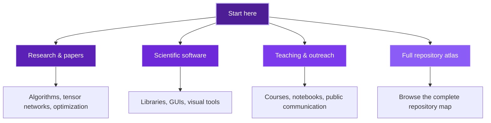

  <a href="./README.md"><strong>English</strong></a> |
  <a href="./README.es.md">Español</a>

  

<h1 align="center">Alejandro Mata Ali</h1>

  <strong>Researcher · Scientific software developer · Educator · Science communicator</strong>

  Quantum algorithms, tensor networks, optimization, and computational physics turned into
  reusable tools, reproducible workflows, and explanations that people can actually use.

  Quantum Coordinator at ITCL · Burgos, Spain

  
  
  

  
  
  
  
  
  

  <a href="#overview">Overview</a> |
  <a href="#flagship-projects">Flagship Projects</a> |
  <a href="#research-compass">Research Compass</a> |
  <a href="#research--papers">Research & Papers</a> |
  <a href="#teaching--outreach">Teaching & Outreach</a> |
  <a href="#project-atlas">Project Atlas</a> |
  <a href="#stack">Stack</a>

## Overview

This profile is the public landing page for my work across research, scientific software, teaching, and outreach.
If you arrive here through a paper, a repository, a class, or a talk, this README is meant to help you find the right entry point quickly.

<table>
  <tr>
    <td width="33%" valign="top">
      <strong>Research</strong> 
      Quantum algorithms, tensor networks, optimization methods, and computational physics connected to papers, experiments, and reproducible workflows.
    </td>
    <td width="33%" valign="top">
      <strong>Scientific Software</strong> 
      Python libraries, visual tooling, GUIs, and reusable templates that make advanced workflows easier to inspect, test, and reuse.
    </td>
    <td width="33%" valign="top">
      <strong>Teaching & Outreach</strong> 
      Courses, notebooks, demos, and public communication designed to make advanced topics clearer without flattening their depth.
    </td>
  </tr>
</table>

<table>
  <tr>
    <td width="50%" valign="top">
      <strong>If you are here for papers</strong> 
      Start in <a href="#research--papers">Research & Papers</a> and then open the full <a href="#project-atlas">Project Atlas</a>.
    </td>
    <td width="50%" valign="top">
      <strong>If you are here for usable tools</strong> 
      Start in <a href="#flagship-projects">Flagship Projects</a> for the strongest software-facing repositories.
    </td>
  </tr>
  <tr>
    <td width="50%" valign="top">
      <strong>If you are here to learn</strong> 
      Go to <a href="#teaching--outreach">Teaching & Outreach</a> for courses, notebooks, and demos.
    </td>
    <td width="50%" valign="top">
      <strong>If you want the whole map</strong> 
      Open the expandable repository catalog in <a href="#project-atlas">Project Atlas</a>.
    </td>
  </tr>
</table>

## Flagship Projects

These are the repositories that best represent the intersection of research, tooling, and usability in my work.

<table>
  <tr>
    <td width="50%" valign="top">
      <h3><a href="https://github.com/DOKOS-TAYOS/Tensor-Network-Visualization">Tensor-Network-Visualization</a></h3>
      
2D and 3D tensor network visualization across Torch, NumPy, Quimb, Tensorkrowch, TenPy, and TensorNetwork for analysis, debugging, and communication.

      
<code>Visualization</code> <code>Scientific Python</code> <code>Tensor Networks</code>

    </td>
    <td width="50%" valign="top">
      <h3><a href="https://github.com/DOKOS-TAYOS/Tensor-Network-Editor">Tensor-Network-Editor</a></h3>
      
Interactive local editor for designing tensor networks visually and exporting readable Python code for several backends.

      
<code>Tensor Networks</code> <code>Visual Tooling</code> <code>Code Generation</code>

    </td>
  </tr>
  <tr>
    <td width="50%" valign="top">
      <h3><a href="https://github.com/DOKOS-TAYOS/quantum-circuit-drawer">quantum-circuit-drawer</a></h3>
      
Matplotlib-based library for drawing quantum circuits, plotting measurement results, and comparing outputs across different ecosystems.

      
<code>Quantum Circuits</code> <code>Python</code> <code>Visualization</code>

    </td>
    <td width="50%" valign="top">
      <h3><a href="https://github.com/DOKOS-TAYOS/RegressionLab">RegressionLab</a></h3>
      
Curve fitting software with GUI support, multiple models, uncertainty analysis, and polished visual output for scientific and educational work.

      
<code>Data Analysis</code> <code>Curve Fitting</code> <code>Scientific Software</code>

    </td>
  </tr>
  <tr>
    <td width="50%" valign="top">
      <h3><a href="https://github.com/DOKOS-TAYOS/DifferentialLab">DifferentialLab</a></h3>
      
Numerical solver and visualizer for ODEs, difference equations, and PDEs through an accessible Python desktop interface.

      
<code>ODEs</code> <code>Simulation</code> <code>Scientific Software</code>

    </td>
    <td width="50%" valign="top">
      <h3><a href="https://github.com/DOKOS-TAYOS/Traveling_Salesman_Problem_with_Tensor_Networks">TSP with Tensor Networks</a></h3>
      
Quantum-inspired TSP solver built as a research-driven exploration of tensor networks, optimization, and scientific communication.

      
<code>Research</code> <code>Optimization</code> <code>Tensor Networks</code>

    </td>
  </tr>
</table>

## Research Compass

## Research & Papers

These repositories connect directly to papers, experiments, and algorithmic work:

- [TSP with Tensor Networks](https://github.com/DOKOS-TAYOS/Traveling_Salesman_Problem_with_Tensor_Networks) - quantum-inspired TSP solver with a research narrative around tensor networks. [Paper](https://arxiv.org/abs/2311.14344)
- [HHL with Tensor Networks](https://github.com/DOKOS-TAYOS/Tensor_Networks_HHL_algorithm) - classical simulation of the HHL algorithm with tensor networks. [Paper](https://arxiv.org/abs/2309.05290)
- [Linear Chain QUBO and QUDO](https://github.com/DOKOS-TAYOS/Lineal_chain_QUBO_QUDO_TensorQUDO_Solver_with_Tensor_Networks) - polynomial-time solver for tridiagonal QUBO, QUDO, and Tensor QUDO formulations. [Paper](https://arxiv.org/abs/2309.10509)
- [Efficient Tensor Network Initialization](https://github.com/DOKOS-TAYOS/Efficient_Initialization_Tensor_Networks) - finite initialization with partial norms for tensor neural networks. [Paper](https://arxiv.org/abs/2309.06577)
- [Task Scheduler with Tensor Networks](https://github.com/DOKOS-TAYOS/Task_Scheduler_with_Tensor_Networks) - scheduling optimization through tensor network methods. [Paper](https://arxiv.org/abs/2311.10433)
- [HoLCUs_QAOA](https://github.com/DOKOS-TAYOS/HoLCUs_QAOA) - HoLCUs experiments connected to QAOA and quantum optimization. [Paper](https://arxiv.org/abs/2503.01748)
- [Hotels-TSP-Tensor-QUDO](https://github.com/DOKOS-TAYOS/Hotels-TSP-Tensor-QUDO) - travel-search-style TSP explored through QAOA, QUBO, and Tensor QUDO formulations

## Teaching & Outreach

I use GitHub not only to publish results, but also to teach and communicate ideas more openly:

- [Curso_Algoritmos_Cuanticos_Qiskit](https://github.com/DOKOS-TAYOS/Curso_Algoritmos_Cuanticos_Qiskit) - quantum algorithms course with practical Qiskit notebooks
- [QAOA_Foro_Nuevos_Paradigmas](https://github.com/DOKOS-TAYOS/QAOA_Foro_Nuevos_Paradigmas) - workshop-style QAOA implementation prepared for a public session
- [Mini-Qiskit_with_Tensor_Networks](https://github.com/DOKOS-TAYOS/Mini-Qiskit_with_Tensor_Networks) - educational mini-Qiskit built with tensor networks
- [Shor-Algorithm](https://github.com/DOKOS-TAYOS/Shor-Algorithm) - educational implementation and review material around Shor's algorithm
- [IBM-Qiskit-Fall-Fest-Quantum-Challenge](https://github.com/DOKOS-TAYOS/IBM-Qiskit-Fall-Fest-Quantum-Challenge) - notebooks and submission for the IBM Qiskit Fall Fest Quantum Challenge

I also run [When Physics](https://www.youtube.com/@whenphysics), a channel where I share physics and quantum computing with a broader audience.

  

## Current Direction

Right now I am especially focused on:

- building tensor-network tooling that is more visual, inspectable, and code-friendly
- turning research prototypes into reusable and better structured scientific Python packages
- connecting advanced quantum and numerical ideas with material that works for both specialists and learners

## Project Atlas

If you want the broader catalog, here is the repository map grouped by intent.

<table>
  <tr>
    <td width="25%" valign="top">
      <strong>Read papers</strong> 
      Tensor-network algorithms, optimization, HHL, QAOA, and related research repositories.
    </td>
    <td width="25%" valign="top">
      <strong>Use tools</strong> 
      Visual editors, scientific GUIs, and reusable software for research and teaching.
    </td>
    <td width="25%" valign="top">
      <strong>Learn concepts</strong> 
      Courses, notebooks, educational implementations, and workshop material.
    </td>
    <td width="25%" valign="top">
      <strong>Explore side work</strong> 
      Templates, utilities, legacy projects, and smaller applied experiments.
    </td>
  </tr>
</table>

  
<strong>Open the full project map</strong>

### Scientific software and libraries

- [Tensor-Network-Visualization](https://github.com/DOKOS-TAYOS/Tensor-Network-Visualization) - 2D and 3D tensor network visualization across major Python backends
- [Tensor-Network-Editor](https://github.com/DOKOS-TAYOS/Tensor-Network-Editor) - visual editor that exports readable Python code for several tensor-network ecosystems
- [quantum-circuit-drawer](https://github.com/DOKOS-TAYOS/quantum-circuit-drawer) - Matplotlib-based quantum circuit drawing and result visualization
- [RegressionLab](https://github.com/DOKOS-TAYOS/RegressionLab) - curve fitting GUI for experimental and classroom data
- [DifferentialLab](https://github.com/DOKOS-TAYOS/DifferentialLab) - numerical solver and visualizer for ODEs, difference equations, and PDEs

### Research repositories linked to papers

- [Traveling_Salesman_Problem_with_Tensor_Networks](https://github.com/DOKOS-TAYOS/Traveling_Salesman_Problem_with_Tensor_Networks) - tensor-network TSP solver. [Paper](https://arxiv.org/abs/2311.14344)
- [Tensor_Networks_HHL_algorithm](https://github.com/DOKOS-TAYOS/Tensor_Networks_HHL_algorithm) - HHL simulation with tensor networks. [Paper](https://arxiv.org/abs/2309.05290)
- [Lineal_chain_QUBO_QUDO_TensorQUDO_Solver_with_Tensor_Networks](https://github.com/DOKOS-TAYOS/Lineal_chain_QUBO_QUDO_TensorQUDO_Solver_with_Tensor_Networks) - tensor-network solver for linear-chain QUBO and QUDO. [Paper](https://arxiv.org/abs/2309.10509)
- [Efficient_Initialization_Tensor_Networks](https://github.com/DOKOS-TAYOS/Efficient_Initialization_Tensor_Networks) - initialization methods for tensor neural networks. [Paper](https://arxiv.org/abs/2309.06577)
- [Task_Scheduler_with_Tensor_Networks](https://github.com/DOKOS-TAYOS/Task_Scheduler_with_Tensor_Networks) - scheduling optimization with tensor networks. [Paper](https://arxiv.org/abs/2311.10433)
- [HoLCUs_QAOA](https://github.com/DOKOS-TAYOS/HoLCUs_QAOA) - HoLCUs and QAOA experiments. [Paper](https://arxiv.org/abs/2503.01748)

### Applied quantum optimization and exploratory work

- [Hotels-TSP-Tensor-QUDO](https://github.com/DOKOS-TAYOS/Hotels-TSP-Tensor-QUDO) - travel-search-style TSP with QAOA, QUBO, and Tensor QUDO formulations
- [mbqc-tn](https://github.com/DOKOS-TAYOS/mbqc-tn) - exploratory MBQC and tensor-network work

### Learning, notebooks, and outreach

- [Curso_Algoritmos_Cuanticos_Qiskit](https://github.com/DOKOS-TAYOS/Curso_Algoritmos_Cuanticos_Qiskit) - quantum algorithms course with practical notebooks
- [QAOA_Foro_Nuevos_Paradigmas](https://github.com/DOKOS-TAYOS/QAOA_Foro_Nuevos_Paradigmas) - public-session QAOA implementation
- [Mini-Qiskit_with_Tensor_Networks](https://github.com/DOKOS-TAYOS/Mini-Qiskit_with_Tensor_Networks) - educational mini-Qiskit built with tensor networks
- [Shor-Algorithm](https://github.com/DOKOS-TAYOS/Shor-Algorithm) - educational Shor implementation and review material
- [IBM-Qiskit-Fall-Fest-Quantum-Challenge](https://github.com/DOKOS-TAYOS/IBM-Qiskit-Fall-Fest-Quantum-Challenge) - challenge submission and notebooks

### Computational physics and legacy scientific work

- [Experimento-FPUT](https://github.com/DOKOS-TAYOS/Experimento-FPUT) - FPUT simulation in Fortran and Python
- [Skyrme-rho-with-6-term-in-instanton-app](https://github.com/DOKOS-TAYOS/Skyrme-rho-with-6-term-in-instanton-app) - symbolic and numerical work for a Skyrme-model application
- [Ajustador](https://github.com/DOKOS-TAYOS/Ajustador) - earlier fitting tool and historical precursor to later data-analysis software

### Templates, utilities, and side projects

- [Tensor-Network-Image-Analysis-Template](https://github.com/DOKOS-TAYOS/Tensor-Network-Image-Analysis-Template) - starter for tensor-network image classification with PyTorch and TensorKrowch
- [vibe_template](https://github.com/DOKOS-TAYOS/vibe_template) - reusable Python project template with CLI and quality scaffolding
- [TransTools](https://github.com/DOKOS-TAYOS/TransTools) - public utilities repository
- [PickCounter](https://github.com/DOKOS-TAYOS/PickCounter) - image-based guitar pick counting and color classification
- [Sun-Glare-Aware-Router](https://github.com/DOKOS-TAYOS/Sun-Glare-Aware-Router) - route-planning experiment that accounts for sun glare
- [sunny-places](https://github.com/DOKOS-TAYOS/sunny-places) - side experiment around sun-aware place exploration
- [desktop_config](https://github.com/DOKOS-TAYOS/desktop_config) - personal desktop configuration repository

### Profile and meta

- [DOKOS-TAYOS](https://github.com/DOKOS-TAYOS/DOKOS-TAYOS) - repository behind this profile README

## Stack

  
  
  
  
  
  
  
  
  
  

  <em>From papers to packages, from notebooks to public explanations.</em>

